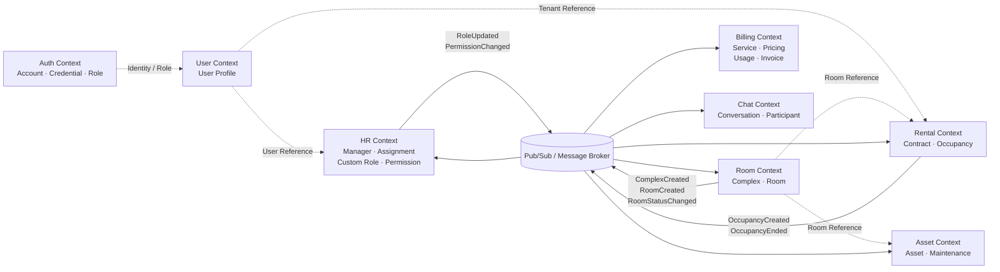

```mermaid
flowchart LR

    AUTH["Auth Context<br/>Account · Credential · Role"]

    USER["User Context<br/>User Profile"]

    HR["HR Context<br/>Manager · Assignment<br/>Custom Role · Permission"]

    ROOM["Room Context<br/>Complex · Room"]

    RENTAL["Rental Context<br/>Contract · Occupancy"]

    ASSET["Asset Context<br/>Asset · Maintenance"]

    BILLING["Billing Context<br/>Service · Pricing<br/>Usage · Invoice"]

    CHAT["Chat Context<br/>Conversation · Participant"]

    BROKER[("Pub/Sub / Message Broker")]


    AUTH -. "Identity / Role" .-> USER
    USER -. "User Reference" .-> HR
    USER -. "Tenant Reference" .-> RENTAL

    ROOM -. "Room Reference" .-> RENTAL
    ROOM -. "Room Reference" .-> ASSET

    RENTAL -->|"OccupancyCreated<br/>OccupancyEnded"| BROKER
    ROOM -->|"ComplexCreated<br/>RoomCreated<br/>RoomStatusChanged"| BROKER
    HR -->|"RoleUpdated<br/>PermissionChanged"| BROKER

    BROKER --> CHAT
    BROKER --> BILLING
    BROKER --> HR
    BROKER --> ROOM
    BROKER --> ASSET
    BROKER --> RENTAL
```